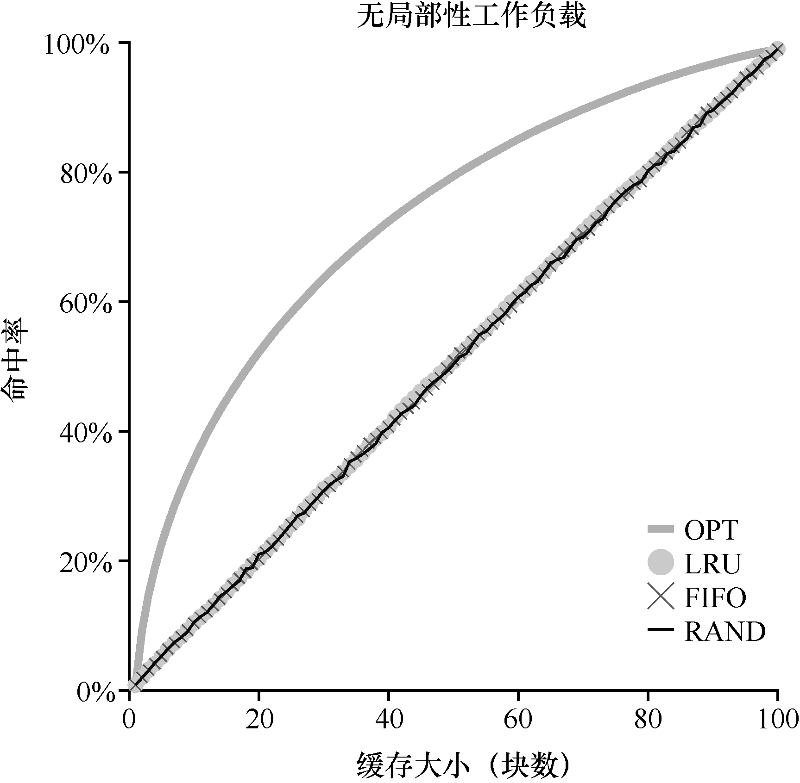
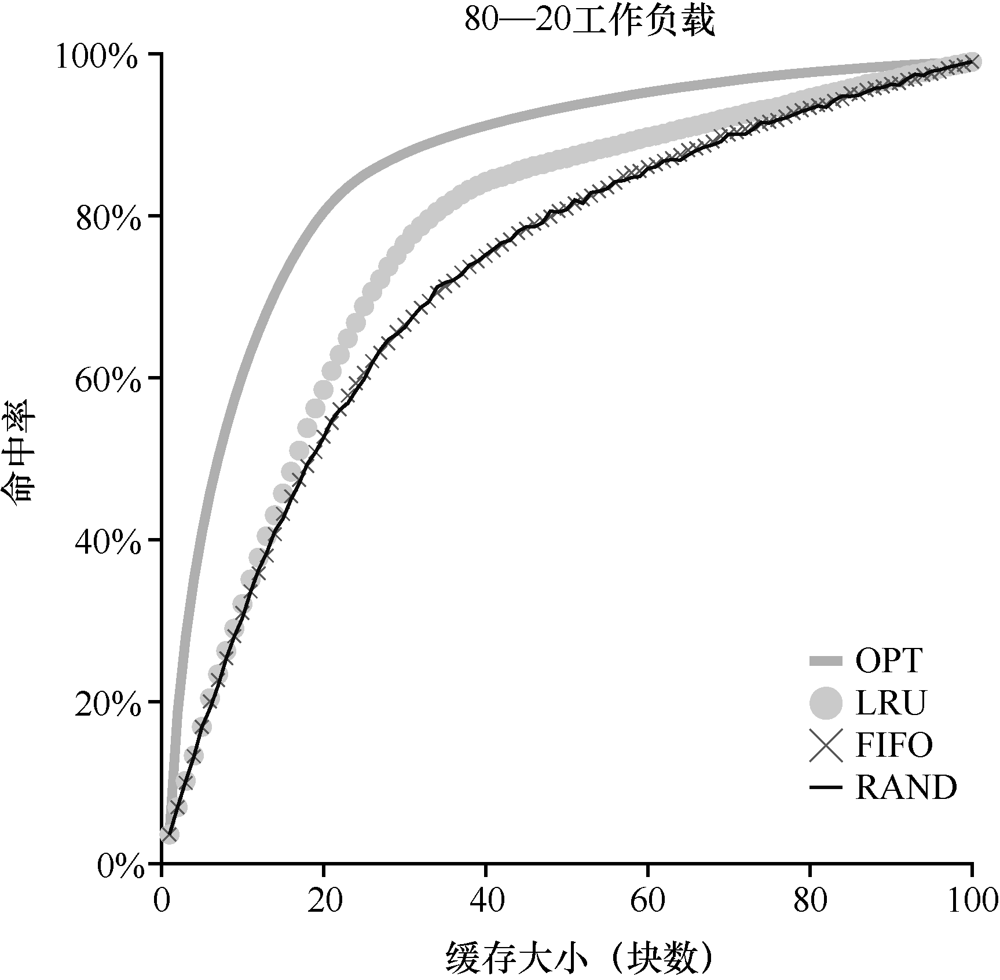

# 第22章 超越物理内存：策略

在虚拟内存管理程序中，如果拥有大量空闲内存，操作就会变得很容易。页错误发生了，你在空闲页列表中找到空闲页，将它分配给不在内存中的页。嘿，操作系统，恭喜！你又成功了。

遗憾的是，当内存不够时事情会变得更有趣。在这种情况下，由于内存压力（memory pressure）迫使操作系统换出（paging out）一些页，为常用的页腾出空间。确定要踢出（evict）哪个页（或哪些页）封装在操作系统的替换策略（replacement policy）中。历史上，这是早期的虚拟内存系统要做的最重要的决定之一，因为旧系统的物理内存非常小。至少，有一些策略是非常值得了解的。

## 关键问题：如何决定踢出哪个页

操作系统如何决定从内存中踢出哪一页（或哪几页）？这个决定由系统的替换策略做出，替换策略通常会遵循一些通用的原则（下面将会讨论），但也会包括一些调整，以避免特殊情况下的行为。

## 22.1 缓存管理

在深入研究策略之前，先详细描述一下我们要解决的问题。由于内存只包含系统中所有页的子集，因此可以将其视为系统中虚拟内存页的缓存（cache）。因此，在为这个缓存选择替换策略时，我们的目标是让缓存未命中（cache miss）最少，即使得从磁盘获取页的次数最少。或者，可以将目标看成让缓存命中（cache hit）最多，即在内存中找到待访问页的次数最多。

知道了缓存命中和未命中的次数，就可以计算程序的平均内存访问时间（Average Memory Access Time，AMAT，计算机架构师衡量硬件缓存的指标[HP06]）。具体来说，给定这些值，可以按照如下公式计算AMAT：

```
AMAT = (PHit·TM) + (PMiss·TD)
```

其中 TM表示访问内存的成本，TD表示访问磁盘的成本，PHit表示在缓存中找到数据的概率（命中），PMiss表示在缓存中找不到数据的概率（未命中）。PHit和PMiss从0.0变化到1.0，并且 PMiss + PHit = 1.0。

例如，假设有一个机器有小型地址空间：4KB，每页256字节。因此，虚拟地址由两部分组成：一个4位VPN（最高有效位）和一个8位偏移量（最低有效位）。因此，本例中的一个进程可以访问总共 2^4 = 16个虚拟页。在这个例子中，该进程将产生以下内存引用（即虚拟地址）0x000，0x100，0x200，0x300，0x400，0x500，0x600，0x700，0x800，0x900。

这些虚拟地址指向地址空间中前10页的每一页的第一个字节（页号是每个虚拟地址的第一个十六进制数字）。

让我们进一步假设，除了虚拟页3之外，所有页都已经在内存中。因此，我们的内存引用序列将遇到以下行为：命中，命中，命中，未命中，命中，命中，命中，命中，命中。我们可以计算命中率（hit rate，在内存中找到引用的百分比）：90%（PHit = 0.9），因为10个引用中有9个在内存中。未命中率（miss rate）显然是10%（PMiss = 0.1）。

要计算AMAT，需要知道访问内存的成本和访问磁盘的成本。假设访问内存（TM）的成本约为100ns，并且访问磁盘（TD）的成本大约为10ms，则我们有以下AMAT：0.9×100ns + 0.1×10ms，即90ns + 1ms 或1.0009ms，或约1ms。如果我们的命中率是99.9%（PMiss = 0.001），结果是完全不同的：AMAT是10.1μs，大约快100倍。当命中率接近100%时，AMAT接近100ns。

遗憾的是，正如你在这个例子中看到的，在现代系统中，磁盘访问的成本非常高，即使很小概率的未命中也会拉低正在运行的程序的总体AMAT。显然，我们必须尽可能地避免缓存未命中，避免程序以磁盘的速度运行。要做到这一点，有一种方法就是仔细开发一个聪明的策略，像我们现在所做的一样。

## 22.2 最优替换策略

为了更好地理解一个特定的替换策略是如何工作的，将它与最好的替换策略进行比较是很好的方法。事实证明，这样一个最优（optimal）策略是Belady多年前开发的[B66]（原来这个策略叫作MIN）。最优替换策略能达到总体未命中数量最少。Belady展示了一个简单的方法（但遗憾的是，很难实现！），即替换内存中在最远将来才会被访问到的页，可以达到缓存未命中率最低。

### 提示：与最优策略对比非常有用

虽然最优策略非常不切实际，但作为仿真或其他研究的比较者还是非常有用的。比如，单说你喜欢的新算法有80%的命中率是没有意义的，但加上最优算法只有82%的命中率（因此你的新方法非常接近最优），就会使得结果很有意义，并给出了它的上下文。因此，在你进行的任何研究中，知道最优策略可以方便进行对比，知道你的策略有多大的改进空间，也用于决定当策略已经非常接近最优策略时，停止做无谓的优化[AD03]。

希望最优策略背后的想法你能理解。这样想：如果你不得不踢出一些页，为什么不踢出在最远将来才会访问的页呢？这样做基本上是说，缓存中所有其他页都比这个页重要。道理很简单：在引用最远将来会访问的页之前，你肯定会引用其他页。

我们追踪一个简单的例子，来理解最优策略的决定。假设一个程序按照以下顺序访问虚拟页：0，1，2，0，1，3，0，3，1，2，1。表22.1展示了最优的策略，这里假设缓存可以存3个页。

在表22.1中，可以看到以下操作。不要惊讶，前3个访问是未命中，因为缓存开始是空的。这种未命中有时也称作冷启动未命中（cold-start miss，或强制未命中，compulsory miss）。然后我们再次引用页0和1，它们都在缓存中。最后，我们又有一个缓存未命中（页3），但这时缓存已满，必须进行替换！这引出了一个问题：我们应该替换哪个页？使用最优策略，我们检查当前缓存中每个页（0、1和2）未来访问情况，可以看到页0马上被访问，页1稍后被访问，页2在最远的将来被访问。因此，最优策略的选择很简单：踢出页面2，结果是缓存中的页面是0、1和3。接下来的3个引用是命中的，然后又访问到被我们之前踢出的页2，那么又有一个未命中。这里，最优策略再次检查缓存页（0、1和3）中每个页面的未来被访问情况，并且看到只要不踢出页1（即将被访问）就可以。这个例子显示了页3被踢出，虽然踢出0也是可以的。最后，我们命中页1，追踪完成。

**表22.1 追踪最优策略**

| 访问 | 命中/未命中 | 踢出 | 导致缓存状态 |
|------|-------------|------|---------------|
| 0    | 未命中      |      | 0             |
| 1    | 未命中      |      | 0、1          |
| 2    | 未命中      |      | 0、1、2       |
| 0    | 命中        |      | 0、1、2       |
| 1    | 命中        |      | 0、1、2       |
| 3    | 未命中      | 2    | 0、1、3       |
| 0    | 命中        |      | 0、1、3       |
| 3    | 命中        |      | 0、1、3       |
| 1    | 命中        |      | 0、1、3       |
| 2    | 未命中      | 3    | 0、1、2       |
| 1    | 命中        |      | 0、1、2       |

#### 补充：缓存未命中的类型

在计算机体系结构世界中，架构师有时会将未命中分为3类：强制性、容量和冲突未命中，有时称为3C[H87]。发生强制性（compulsory miss）未命中（或冷启动未命中，cold-start miss[EF78]）是因为缓存开始是空的，而这是对项目的第一次引用。与此不同，由于缓存的空间不足而不得不踢出一个项目以将新项目引入缓存，就发生了容量未命中（capacity miss）。第三种类型的未命中（冲突未命中，conflict miss）出现在硬件中，因为硬件缓存中对项的放置位置有限制，这是由于所谓的集合关联性（set-associativity）。它不会出现在操作系统页面缓存中，因为这样的缓存总是完全关联的（fully-associative），即对页面可以放置的内存位置没有限制。详情请见H&P[HP06]。

我们同时计算缓存命中率：有6次命中和5次未命中，那么缓存命中率Hits/(Hits+Misses)是6/(6+5)，或54.5%。也可以计算命中率中除去强制未命中（即忽略页的第一次未命中），那么命中率为81.8%。

遗憾的是，正如我们之前在开发调度策略时所看到的那样，未来的访问是无法知道的，你无法为通用操作系统实现最优策略①。因此，在开发一个真正的、可实现的策略时，我们将聚焦于寻找其他决定把哪个页面踢出的方法。因此，最优策略只能作为比较，知道我们的策略有多接近"完美"。

## 22.3 简单策略：FIFO

许多早期的系统避免了尝试达到最优的复杂性，采用了非常简单的替换策略。例如，一些系统使用FIFO（先入先出）替换策略。页在进入系统时，简单地放入一个队列。当发生替换时，队列尾部的页（"先入"页）被踢出。FIFO有一个很大的优势：实现相当简单。

让我们来看看FIFO策略如何执行这过程（见表22.2）。我们再次开始追踪3个页面0、1和2。首先是强制性未命中，然后命中页0和1。接下来，引用页3，缓存未命中。使用FIFO策略决定替换哪个页面是很容易的：选择第一个进入的页，这里是页0（表中的缓存状态列是按照先进先出顺序，最左侧是第一个进来的页），遗憾的是，我们的下一个访问还是页0，导致另一次未命中和替换（替换页1）。然后我们命中页3，但是未命中页1和2，最后命中页3。

**表22.2 追踪FIFO策略**

| 访问 | 命中/未命中 | 踢出 | 导致缓存状态 |
|------|-------------|------|---------------|
| 0    | 未命中      |      | 先入→0        |
| 1    | 未命中      |      | 先入→0、1     |
| 2    | 未命中      |      | 先入→0、1、2  |
| 0    | 命中        |      | 先入→0、1、2  |
| 1    | 命中        |      | 先入→0、1、2  |
| 3    | 未命中      | 0    | 先入→1、2、3  |
| 0    | 未命中      | 1    | 先入→2、3、0  |
| 3    | 命中        |      | 先入→2、3、0  |
| 1    | 未命中      | 2    | 先入→3、0、1  |
| 2    | 未命中      | 3    | 先入→0、1、2  |
| 1    | 命中        |      | 先入→0、1、2  |

对比FIFO和最优策略，FIFO明显不如最优策略，FIFO命中率只有36.4%（不包括强制性未命中为57.1%）。先进先出（FIFO）根本无法确定页的重要性：即使页0已被多次访问，FIFO仍然会将其踢出，因为它是第一个进入内存的。

### 补充：Belady的异常

Belady（最优策略发明者）及其同事发现了一个有意思的引用序列[BNS69]。内存引用顺序是：1，2，3，4，1，2，5，1，2，3，4，5。他们正在研究的替换策略是FIFO。有趣的问题：当缓存大小从3变成4时，缓存命中率如何变化？

① 如果你可以，请告诉我们，我们可以一起发财，或者，像"发现"冷聚变的科学家一样，被众人所讽刺和嘲笑[FP89]。

一般来说，当缓存变大时，缓存命中率是会提高的（变好）。但在这个例子，采用FIFO，命中率反而下降了！你可以自己计算一下缓存命中和未命中次数。这种奇怪的现象被称为Belady的异常（Belady's Anomaly）。

其他一些策略，比如LRU，不会遇到这个问题。可以猜猜为什么？事实证明，LRU具有所谓的栈特性（stack property）[M+70]。对于具有这个性质的算法，大小为N+1的缓存自然包括大小为N的缓存的内容。因此，当增加缓存大小时，缓存命中率至少保证不变，有可能提高。先进先出（FIFO）和随机（Random）等显然没有栈特性，因此容易出现异常行为。

## 22.4 另一简单策略：随机

另一个类似的替换策略是随机，在内存满的时候它随机选择一个页进行替换。随机具有类似于FIFO的属性。实现很简单，但是它在挑选替换哪个页时不够智能。让我们来看看随机策略在我们著名的例子上的引用流程（见表22.3）。

**表22.3 追踪随机策略**

| 访问 | 命中/未命中 | 踢出 | 导致缓存状态 |
|------|-------------|------|---------------|
| 0    | 未命中      |      | 0             |
| 1    | 未命中      |      | 0、1          |
| 2    | 未命中      |      | 0、1、2       |
| 0    | 命中        |      | 0、1、2       |
| 1    | 命中        |      | 0、1、2       |
| 3    | 未命中      | 0    | 1、2、3       |
| 0    | 未命中      | 1    | 2、3、0       |
| 3    | 命中        |      | 2、3、0       |
| 1    | 未命中      | 3    | 2、0、1       |
| 2    | 命中        |      | 2、0、1       |
| 1    | 命中        |      | 2、0、1       |


当然，随机的表现完全取决于多幸运（或不幸）。在上面的例子中，随机比FIFO好一点，比最优的差一点。事实上，我们可以运行数千次的随机实验，求得一个平均的结果。图22.1显示了10000次试验后随机策略的平均命中率，每次试验都有不同的随机种子。正如你所看到的，有些时候（仅仅40%的概率），随机和最优策略一样好，在上述例子中，命中内存的次数是6次。有时候情况会更糟糕，只有2次或更少。随机策略取决于当时的运气。

## 22.5 利用历史数据：LRU

遗憾的是，任何像FIFO或随机这样简单的策略都可能会有一个共同的问题：它可能会踢出一个重要的页，而这个页马上要被引用。先进先出（FIFO）将先进入的页踢出。如果这恰好是一个包含重要代码或数据结构的页，它还是会被踢出，尽管它很快会被重新载入。因此，FIFO、Random和类似的策略不太可能达到最优，需要更智能的策略。

正如在调度策略所做的那样，为了提高后续的命中率，我们再次通过历史的访问情况作为参考。例如，如果某个程序在过去访问过某个页，则很有可能在不久的将来会再次访问该页。

页替换策略可以使用的一个历史信息是频率（frequency）。如果一个页被访问了很多次，也许它不应该被替换，因为它显然更有价值。页更常用的属性是访问的近期性（recency），越近被访问过的页，也许再次访问的可能性也就越大。

这一系列的策略是基于人们所说的局部性原则（principle of locality）[D70]，基本上只是对程序及其行为的观察。这个原理简单说就是程序倾向于频繁地访问某些代码（例如循环）和数据结构（例如循环访问的数组）。因此，我们应该尝试用历史数据来确定哪些页面更重要，并在需要踢出页时将这些页保存在内存中。

因此，一系列简单的基于历史的算法诞生了。"最不经常使用"（Least-Frequently-Used，LFU）策略会替换最不经常使用的页。同样，"最少最近使用"（Least-Recently-Used，LRU）策略替换最近最少使用的页面。这些算法很容易记住：一旦知道这个名字，就能确切知道它是什么，这种名字就非常好。

#### 补充：局部性类型

程序倾向于表现出两种类型的局部。第一种是空间局部性（spatial locality），它指出如果页P被访问，可能围绕它的页（比如P−1或P+1）也会被访问。第二种是时间局部性（temporal locality），它指出近期访问过的页面很可能在不久的将来再次访问。假设存在这些类型的局部性，对硬件系统的缓存层次结构起着重要作用，硬件系统部署了许多级别的指令、数据和地址转换缓存，以便在存在此类局部性时，能帮助程序快速运行。

当然，通常所说的局部性原则（principle of locality）并不是硬性规定，所有的程序都必须遵守。事实上，一些程序以相当随机的方式访问内存（或磁盘），并且在其访问序列中不显示太多或完全没有局部性。因此，尽管在设计任何类型的缓存（硬件或软件）时，局部性都是一件好事，但它并不能保证成功。相反，它是一种经常证明在计算机系统设计中有用的启发式方法。

为了更好地理解LRU，我们来看看LRU如何在示例引用序列上执行。表22.4展示了结果。从表中，可以看到LRU如何利用历史记录，比无状态策略（如随机或FIFO）做得更好。在这个例子中，当第一次需要替换页时，LRU会踢出页2，因为0和1的访问时间更近。然后它替换页0，因为1和3最近被访问过。在这两种情况下，基于历史的LRU的决定证明是更准确的，并且下一个引用也是命中。因此，在我们的简单例子中，LRU的表现几乎快要赶上最优策略了①。

**表22.4 追踪LRU策略**

| 访问 | 命中/未命中 | 踢出 | 导致缓存状态 |
|------|-------------|------|---------------|
| 0    | 未命中      |      | LRU→0         |
| 1    | 未命中      |      | LRU→0、1      |
| 2    | 未命中      |      | LRU→0、1、2   |
| 0    | 命中        |      | LRU→1、2、0   |
| 1    | 命中        |      | LRU→2、0、1   |
| 3    | 未命中      | 2    | LRU→0、1、3   |
| 0    | 命中        |      | LRU→1、3、0   |
| 3    | 命中        |      | LRU→1、0、3   |
| 1    | 命中        |      | LRU→0、3、1   |
| 2    | 未命中      | 0    | LRU→3、1、2   |
| 1    | 命中        |      | LRU→3、2、1   |

我们也应该注意到，与这些算法完全相反的算法也是存在：最经常使用策略（Most-Frequently-Used，MFU）和最近使用策略（Most-Recently-Used，MRU）。在大多数情况下（不是全部！），这些策略效果都不好，因为它们忽视了大多数程序都具有的局部性特点。

## 22.6 工作负载示例

让我们再看几个例子，以便更好地理解这些策略。在这里，我们将查看更复杂的工作负载（workload），而不是追踪小例子。但是，这些工作负载也被大大简化了。更好的研究应该包含应用程序追踪。

第一个工作负载没有局部性，这意味着每个引用都是访问一个随机页。在这个简单的例子中，工作负载每次访问独立的100个页，随机选择下一个要引用的页。总体来说，访问了10000个页。在实验中，我们将缓存大小从非常小（1页）变化到足以容纳所有页（100页），以便了解每个策略在缓存大小范围内的表现。



图22.2展示了最优、LRU、随机和FIFO策略的实验结果。图22.2中的y轴显示了每个策略的命中率。如上所述，x轴表示缓存大小的变化。

我们可以从图22.2中得出一些结论。首先，当工作负载不存在局部性时，使用的策略区别不大。LRU、FIFO和随机都执行相同的操作，命中率完全由缓存的大小决定。其次，当缓存足够大到可以容纳所有的数据时，使用哪种策略也无关紧要，所有的策略（甚至是随机的）都有100%的命中率。最后，你可以看到，最优策略的表现明显好于实际的策略。如果有可能的话，偷窥未来，就能做到更好的替换。

① 好吧，我们夸大了结果。但有时候为了证明一个观点，夸大是有必要的。



我们下一个工作负载就是所谓的"80—20"负载场景，它表现出局部性：80%的引用是访问20%的页（"热门"页）。剩下的20%是对剩余的80%的页（"冷门"页）访问。在我们的负载场景，总共有100个不同的页。因此，"热门"页是大部分时间访问的页，其余时间访问的是"冷门"页。图22.3展示了不同策略在这个工作负载下的表现。

从图22.3中可以看出，尽管随机和FIFO都很好地运行，但LRU更好，因为它更可能保持热门页。由于这些页面过去经常被提及，它们很可能在不久的将来再次被提及。优化再次表现得更好，表明LRU的历史信息并不完美。

你现在可能会想：LRU对随机和FIFO的命中率提高真的非常重要么？如往常一样，答案是"视情况而定"。如果每次未命中代价非常大（并不罕见），那么即使小幅提高命中率（降低未命中率）也会对性能产生巨大的影响。如果未命中的代价不那么大，那么LRU带来的好处就不会那么重要。

让我们看看最后一个工作负载。我们称之为"循环顺序"工作负载，其中依次引用50个页，从0开始，然后是1，…，49，然后循环，重复访问，总共有10000次访问50个单独页。图22.4展示了这个工作负载下各个策略的行为。


这种工作负载在许多应用程序（包括重要的商业应用，如数据库[CD85]）中非常常见，展示了LRU或者FIFO的最差情况。这些算法，在循环顺序的工作负载下，踢出较旧的页。遗憾的是，由于工作负载的循环性质，这些较旧的页将比因为策略决定保存在缓存中的页更早被访问。事实上，即使缓存的大小是49页，50个页面的循环连续工作负载也会导致0%的命中率。有趣的是，随机策略明显更好，虽然距离最优策略还有距离，但至少达到了非零的命中率。可以看出随机策略有一些不错的属性，比如不会出现特殊情况下奇怪的结果。

## 22.7 实现基于历史信息的算法

正如你所看到的，像LRU这样的算法通常优于简单的策略（如FIFO或随机），它们可能会踢出重要的页。遗憾的是，基于历史信息的策略带来了一个新的挑战：应该如何实现呢？

以LRU为例。为了实现它，我们需要做很多工作。具体地说，在每次页访问（即每次内存访问，不管是取指令还是加载指令还是存储指令）时，我们都必须更新一些数据，从而将该页移动到列表的前面（即MRU侧）。与FIFO相比，FIFO的页列表仅在页被踢出（通过移除最先进入的页）或者当新页添加到列表（已到列表尾部）时才被访问。为了记录哪些页是最少和最近被使用，系统必须对每次内存引用做一些记录工作。显然，如果不十分小心，这样的记录反而会极大地影响性能。

## 22.8 近似LRU

有一种方法有助于加快速度，就是增加一点硬件支持。例如，硬件可以在每个页访问时更新内存中的时间字段（时间字段可以在每个进程的页表中，或者在内存的某个单独的数组中，每个物理页有一个）。因此，当页被访问时，时间字段将被硬件设置为当前时间。然后，在需要替换页时，操作系统可以简单地扫描系统中所有页的时间字段以找到最近最少使用的页。

遗憾的是，随着系统中页数量的增长，扫描所有页的时间字段只是为了找到最精确最少使用的页，这个代价太昂贵。想象一下一台拥有4GB内存的机器，内存切成4KB的页。这台机器有一百万页，即使以现代CPU速度找到LRU页也将需要很长时间。这就引出了一个：我们是否真的需要找到绝对最旧的页来替换？找到差不多最旧的页可以吗?

### 关键问题：如何实现LRU替换策略

由于实现完美的LRU代价非常昂贵，我们能否实现一个近似的LRU算法，并且依然能够获得预期的效果？

事实证明，答案是肯定的：从计算开销的角度来看，近似LRU更为可行，实际上这也是许多现代系统的做法。这个想法需要硬件增加一个使用位（use bit，有时称为引用位，reference bit），这种做法在第一个支持分页的系统Atlas one-level store[KE+62]中实现。系统的每个页有一个使用位，然后这些使用位存储在某个地方（例如，它们可能在每个进程的页表中，或者只在某个数组中）。每当页被引用（即读或写）时，硬件将使用位设置为1。但是，硬件不会清除该位（即将其设置为0），这由操作系统负责。

操作系统如何利用使用位来实现近似LRU？可以有很多方法，有一个简单的方法称作时钟算法（clock algorithm）[C69]。想象一下，系统中的所有页都放在一个循环列表中。时钟指针（clock hand）开始时指向某个特定的页（哪个页不重要）。当必须进行页替换时，操作系统检查当前指向的页P的使用位是1还是0。如果是1，则意味着页面P最近被使用，因此不适合被替换。然后，P的使用位设置为0，时钟指针递增到下一页（P+1）。该算法一直持续到找到一个使用位为0的页，使用位为0意味着这个页最近没有被使用过（在最坏的情况下，所有的页都已经被使用了，那么就将所有页的使用位都设置为0）。

请注意，这种方法不是通过使用位来实现近似LRU的唯一方法。实际上，任何周期性地清除使用位，然后通过区分使用位是1和0来判定该替换哪个页的方法都是可以的。Corbato的时钟算法只是一个早期成熟的算法，并且具有不重复扫描内存来寻找未使用页的特点，也就是它在最差情况下，只会遍历一次所有内存。


图22.5展示了时钟算法的一个变种的行为。该变种在需要进行页替换时随机扫描各页，如果遇到一个页的引用位为1，就清除该位（即将它设置为0）。直到找到一个使用位为0的页，将这个页进行替换。如你所见，虽然时钟算法不如完美的LRU做得好，但它比不考虑历史访问的方法要好。

## 22.9 考虑脏页

时钟算法的一个小修改（最初也由Corbato[C69]提出），是对内存中的页是否被修改的额外考虑。这样做的原因是：如果页已被修改（modified）并因此变脏（dirty），则踢出它就必须将它写回磁盘，这很昂贵。如果它没有被修改（因此是干净的，clean），踢出就没成本。物理帧可以简单地重用于其他目的而无须额外的I/O。因此，一些虚拟机系统更倾向于踢出干净页，而不是脏页。

为了支持这种行为，硬件应该包括一个修改位（modified bit，又名脏位，dirty bit）。每次写入页时都会设置此位，因此可以将其合并到页面替换算法中。例如，时钟算法可以被改变，以扫描既未使用又干净的页先踢出。无法找到这种页时，再查找脏的未使用页面，等等。

## 22.10 其他虚拟内存策略

页面替换不是虚拟内存子系统采用的唯一策略（尽管它可能是最重要的）。例如，操作系统还必须决定何时将页载入内存。该策略有时称为页选择（page selection）策略（因为Denning这样命名[D70]），它向操作系统提供了一些不同的选项。

对于大多数页而言，操作系统只是使用按需分页（demand paging），这意味着操作系统在页被访问时将页载入内存中，"按需"即可。当然，操作系统可能会猜测一个页面即将被使用，从而提前载入。这种行为被称为预取（prefetching），只有在有合理的成功机会时才应该这样做。例如，一些系统将假设如果代码页P被载入内存，那么代码页P+1很可能很快被访问，因此也应该被载入内存。

另一个策略决定了操作系统如何将页面写入磁盘。当然，它们可以简单地一次写出一个。然而，许多系统会在内存中收集一些待完成写入，并以一种（更高效）的写入方式将它们写入硬盘。这种行为通常称为聚集（clustering）写入，或者就是分组写入（grouping），这样做有效是因为硬盘驱动器的性质，执行单次大的写操作，比许多小的写操作更有效。

## 22.11 抖动

在结束之前，我们解决了最后一个问题：当内存就是被超额请求时，操作系统应该做什么，这组正在运行的进程的内存需求是否超出了可用物理内存？在这种情况下，系统将不断地进行换页，这种情况有时被称为抖动（thrashing）[D70]。

一些早期的操作系统有一组相当复杂的机制，以便在抖动发生时检测并应对。例如，给定一组进程，系统可以决定不运行部分进程，希望减少的进程工作集（它们活跃使用的页面）能放入内存，从而能够取得进展。这种方法通常被称为准入控制（admission control），它表明，少做工作有时比尝试一下子做好所有事情更好，这是我们在现实生活中以及在现代计算机系统中经常遇到的情况（令人遗憾）。

目前的一些系统采用更严格的方法处理内存过载。例如，当内存超额请求时，某些版本的Linux会运行"内存不足的杀手程序（out-of-memory killer）"。这个守护进程选择一个内存密集型进程并杀死它，从而以不怎么委婉的方式减少内存。虽然成功地减轻了内存压力，但这种方法可能会遇到问题，例如，如果它杀死X服务器，就会导致所有需要显示的应用程序不可用。

## 22.12 小结

我们已经看到了许多页替换（和其他）策略的介绍，这些策略是所有现代操作系统中虚拟内存子系统的一部分。现代系统增加了对时钟等简单LRU近似值的一些调整。例如，扫描抗性（scan resistance）是许多现代算法的重要组成部分，如ARC[MM03]。扫描抗性算法通常是类似LRU的，但也试图避免LRU的最坏情况行为，我们曾在循环顺序工作负载中看到这种情况。因此，页替换算法的发展仍在继续。

然而，在许多情况下，由于内存访问和磁盘访问时间之间的差异增加，这些算法的重要性降低了。由于分页到硬盘非常昂贵，因此频繁分页的成本太高。所以，过度分页的最佳解决方案往往很简单：购买更多的内存。

## 参考资料

[AD03]"Run-Time Adaptation in River" Remzi H. Arpaci-Dusseau
ACM TOCS, 21:1, February 2003
本书作者之一关于River系统的研究工作的总结。当然，在其中，他发现与理想情况做比较是系统设计人员的一项重要技术。

[B66]"A Study of Replacement Algorithms for Virtual-Storage Computer" Laszlo A. Belady
IBM Systems Journal 5(2): 78-101, 1966
这篇文章介绍了计算策略最优行为的简单方法（MIN算法）。

[BNS69]"An Anomaly in Space-time Characteristics of Certain Programs Running in a Paging Machine"
L. A. Belady and R. A. Nelson and G. S. Shedler
Communications of the ACM, 12:6, June 1969
介绍称为"Belady的异常"的内存引用的小序列的文章。我们想知道，Nelson和Shedler如何看待这个名字呢？

[CD85]"An Evaluation of Buffer Management Strategies for Relational Database Systems" Hong-Tai Chou and
David J. DeWitt
VLDB '85, Stockholm, Sweden, August 1985
关于不同缓冲策略的著名数据库文章，你应该使用多种常见数据库访问模式。如果你知道有关工作负载的某些信息，那么就可以制订策略，让它比操作系统中常见的通用目标策略更好。

[C69]"A Paging Experiment with the Multics System"
F.J. Corbato
Included in a Festschrift published in honor of Prof. P.M. Morse MIT Press, Cambridge, MA, 1969
对时钟算法的最初引用（很难找到！），但不是第一次使用位。感谢麻省理工学院的H. Balakrishnan为我们找出这篇论文。

[D70]"Virtual Memory" Peter J. Denning
Computing Surveys, Vol. 2, No. 3, September 1970
Denning对虚拟存储系统的早期著名调查。

[EF78]"Cold-start vs. Warm-start Miss Ratios" Malcolm C. Easton and Ronald Fagin Communications of the
ACM, 21:10, October 1978
关于冷启动与热启动未命中的很好的讨论。

[FP89]"Electrochemically Induced Nuclear Fusion of Deuterium" Martin Fleischmann and Stanley Pons
Journal of Electroanalytical Chemistry, Volume 26, Number 2, Part 1, April, 1989
这篇著名的论文有可能为世界带来革命性的变化，它提供了一种简单的方法，可以从水罐中产生几乎无限的电力，而电力罐中只含有少许金属。但Pons和Fleischmann发表的（并广为宣传的）实验结果无法重现，因此这两位有梦想的科学家都丧失了名誉（当然也受到了嘲笑）。唯一真正为这个结果感到高兴的人是Marvin Hawkins，尽管他参与了这项工作，但他的名字却从本文中被删除了。他因而避免将他的名字与20世纪最大的科学失误之一联系起来。

[HP06]"Computer Architecture: A Quantitative Approach" John Hennessy and David Patterson
Morgan-Kaufmann, 2006
一本关于计算机体系结构的了不起而奇妙的书，必读！

[H87]"Aspects of Cache Memory and Instruction Buffer Performance" Mark D. Hill
Ph.D. Dissertation, U.C. Berkeley, 1987
Mark Hill在其论文工作中介绍了3C，后来因其被包含在H&P[HP06]中而广泛流行。其中的引述："我发现根据未命中的原因直观地将未命中划分为3个部分是有用的（第49页）。"

[KE+62]"One-level Storage System"
T. Kilburn, and D.B.G. Edwards and M.J. Lanigan and F.H. Sumner IRE Trans. EC-11:2, 1962
虽然Atlas有一个使用位，但它只有很少量的页，因此在大型存储器中使用位的扫描并不是作者解决的问题。

[M+70]"Evaluation Techniques for Storage Hierarchies"
R．L. Mattson, J. Gecsei, D. R. Slutz, I. L. Traiger IBM Systems Journal, Volume 9:2, 1970
一篇主要关于如何高效地模拟缓存层次结构的论文。本文无疑是这方面的经典之作，还有对各种替代算法的一些特性的极佳讨论。你能弄清楚为什么栈属性可能对同时模拟很多不同大小的缓存有用吗？

[MM03]"ARC: A Self-Tuning, Low Overhead Replacement Cache" Nimrod Megiddo and Dharmendra S. Modha
FAST 2003, February 2003, San Jose, California
关于替换算法的优秀现代论文，其中包括现在某些系统中使用的新策略ARC。在2014年FAST '14大会上，获得了存储系统社区的"时间考验"奖。

## 作业

这个模拟器paging-policy.py允许你使用不同的页替换策略。详情请参阅README文件。

## 问题

1. 使用以下参数生成随机地址：-s 0 -n 10，-s 1 -n 10 和-s 2 -n 10。将策略从FIFO更改为LRU，并将其更改为OPT。计算所述地址追踪中的每个访问是否命中或未命中。

2. 对于大小为5的高速缓存，为以下每个策略生成最差情况的地址引用序列：FIFO、LRU和MRU（最差情况下的引用序列导致尽可能多的未命中）。对于最差情况下的引用序列，需要的缓存增大多少，才能大幅提高性能，并接近OPT？

3. 生成一个随机追踪序列（使用Python或Perl）。你预计不同的策略在这样的追踪序列上的表现如何？

4. 现在生成一些局部性追踪序列。如何能够产生这样的追踪序列？LRU表现如何？RAND比LRU好多少？CLOCK表现如何？CLOCK使用不同数量的时钟位，表现如何？

5. 使用像valgrind这样的程序来测试真实应用程序并生成虚拟页面引用序列。例如，运行valgrind --tool = lackey --trace-mem = yes ls将为程序ls所做的每个指令和数据引用，输出近乎完整的引用追踪。为了使上述仿真器有用，你必须首先将每个虚拟内存引用转换为虚拟页码参考（通过屏蔽偏移量并向右移位来完成）。为了满足大部分请求，你的应用程序追踪需要多大的缓存？随着缓存大小的增加绘制其工作集的图形。